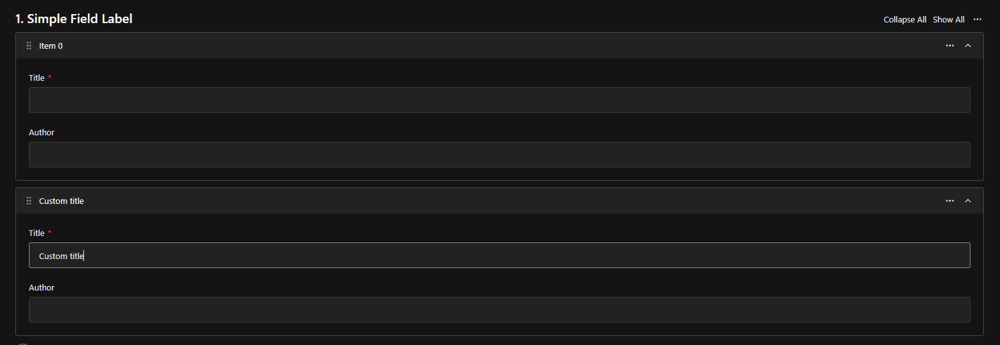
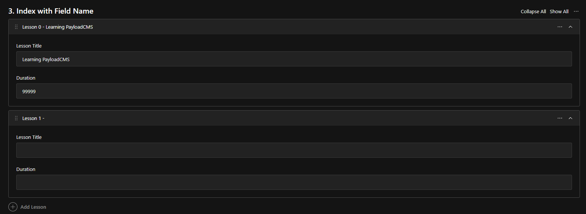
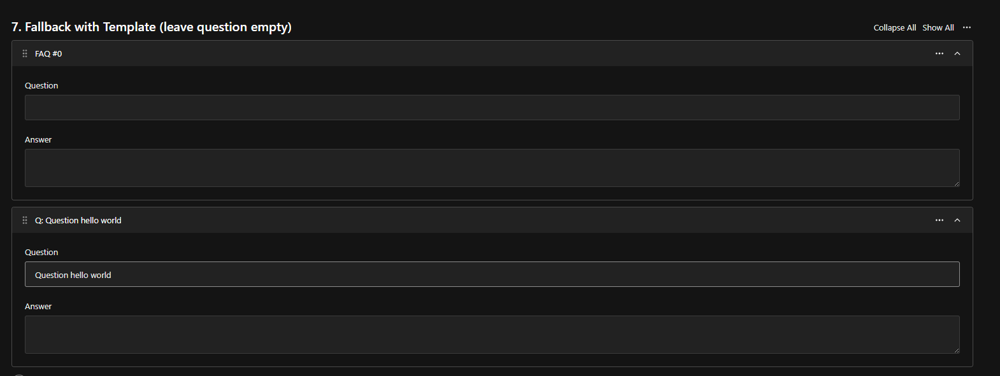

import { TypeTable } from 'fumadocs-ui/components/type-table';

import { ComponentPreview } from "@/components/component-preview"
import { Tabs, TabsContent, TabsList, TabsTrigger } from "@/components/ui/tabs"
import {ManualInstall} from "@/components/manual-install"

<ComponentPreview name="array-row-label" />

<Callout title="Info" type="info">
    This component enhances the user experience when working with array fields by displaying meaningful labels instead of generic "Item 0", "Item 1" labels.
</Callout>

## Installation

<Tabs defaultValue="cli">
  <TabsList >
  <TabsTrigger value="cli">CLI</TabsTrigger>
    <TabsTrigger value="manual">Manual</TabsTrigger>
  </TabsList>
  <TabsContent value="cli">

Use the following command to install the color picker field:

```npm
npx shadcn@latest add https://payload.veiag.dev/r/array-row-label.json
```

<Callout title="Important" type="error">
  Currently, shadcn CLI removes `use client` directive from the top of the files. 
  Please ensure to add it back to the top of `index.tsx` file in the color picker field directory.
  I think this should be fixed in future releases of shadcn CLI.
</Callout>

  </TabsContent>
  <TabsContent value="manual">

Copy and paste the following code into your project:

<ManualInstall name="array-row-label" />

  </TabsContent>
</Tabs>

## Usage

### Basic usage - Simple field

Display a single field value as the array item label:

```typescript
import { customRowLabel } from '@/components/array-row-label/utility'

export const MyCollection = {
  slug: 'articles',
  fields: [
    {
      name: 'articleList',
      type: 'array',
      fields: [
        {
          name: 'title',
          type: 'text',
          required: true,
        },
        {
          name: 'content',
          type: 'textarea',
        },
      ],
      admin: {
        ...customRowLabel({ fieldToUse: 'title' }),
      },
    },
  ],
}
```

### Nested field access

Use dot notation to access deeply nested fields:

```typescript
import { customRowLabel } from '@/components/array-row-label/utility'

export const MyCollection = {
  slug: 'products',
  fields: [
    {
      name: 'inventory',
      type: 'array',
      fields: [
        {
          name: 'product',
          type: 'group',
          fields: [
            {
              name: 'name',
              type: 'text',
            },
            {
              name: 'sku',
              type: 'text',
            },
          ],
        },
      ],
      admin: {
        ...customRowLabel({ fieldToUse: 'product.name' }),
      },
    },
  ],
}
```

### Template mode - Combine multiple fields

Use template syntax with `{{variable}}` to combine multiple values:

```typescript
import { customRowLabel } from '@/components/array-row-label/utility'

export const MyCollection = {
  slug: 'team',
  fields: [
    {
      name: 'members',
      type: 'array',
      fields: [
        {
          name: 'firstName',
          type: 'text',
        },
        {
          name: 'lastName',
          type: 'text',
        },
        {
          name: 'role',
          type: 'text',
        },
      ],
      admin: {
        ...customRowLabel({
          fieldToUse: '{{firstName}} {{lastName}} - {{role}}',
          template: true,
        }),
      },
    },
  ],
}
```

### With fallback label

Provide a fallback when fields are empty:

```typescript
import { customRowLabel } from '@/components/array-row-label/utility'

export const MyCollection = {
  slug: 'slides',
  fields: [
    {
      name: 'presentation',
      type: 'array',
      fields: [
        {
          name: 'heading',
          type: 'text',
        },
        {
          name: 'content',
          type: 'textarea',
        },
      ],
      admin: {
        ...customRowLabel({
          fieldToUse: 'heading',
          fallbackLabel: 'Slide {{index}}',
        }),
      },
    },
  ],
}
```

### Advanced - Template with index and fallback

```typescript
import { customRowLabel } from '@/components/array-row-label/utility'

export const MyCollection = {
  slug: 'tasks',
  fields: [
    {
      name: 'taskList',
      type: 'array',
      fields: [
        {
          name: 'taskName',
          type: 'text',
        },
        {
          name: 'priority',
          type: 'select',
          options: ['low', 'medium', 'high'],
        },
        {
          name: 'status',
          type: 'select',
          options: ['pending', 'in-progress', 'completed'],
        },
      ],
      admin: {
        ...customRowLabel({
          fieldToUse: '[{{priority}}] {{taskName}} - {{status}}',
          template: true,
          fallbackLabel: 'Task {{index}}',
        }),
      },
    },
  ],
}
```

## Screenshots




## API Reference

<TypeTable
  type={{
    fieldToUse: {
      description: 'The field name or template string to use for the label. Supports dot notation for nested fields (e.g., "nested.fieldName"). When template is true, use {{variable}} syntax.',
      type: 'string',
      default: '-',
    },
    template: {
      description: 'Enable template mode to use {{variable}} syntax. Available variables: {{index}} for row number, {{fieldName}} for field values.',
      type: 'boolean',
      default: 'false',
    },
    fallbackLabel: {
      description: 'Label to display when the specified field is empty or not found. Supports {{index}} and {{fieldName}} variables.',
      type: 'string',
      default: "'Item {{index}}'",
    },
  }}
/>

## Template Variables

When `template: true`, you can use the following variables in `fieldToUse` and `fallbackLabel`:

- `{{index}}` - The current row index (0-based)
- `{{fieldName}}` - Any field value, supports dot notation for nested fields

**Example:**
```typescript
fieldToUse: 'Item {{index}}: {{product.name}} ({{product.sku}})'
// Result: "Item 0: Widget Pro (WP-001)"
```

## Features

- **Simple Field Access** - Display any field value as the array item label
- **Nested Field Support** - Use dot notation to access deeply nested fields
- **Template Syntax** - Combine multiple fields with custom formatting using `{{variable}}` syntax
- **Fallback Labels** - Automatic fallback when fields are empty for better UX
- **Smart Empty Detection** - Intelligently detects when all template fields are empty to trigger fallback
- **Index Support** - Include row index in labels with `{{index}}` variable
- **TypeScript Support** - Fully typed with proper TypeScript definitions
- **Zero Configuration** - Works out of the box with sensible defaults

## Common Patterns

### Product Catalog
```typescript
customRowLabel({
  fieldToUse: '{{details.sku}} - {{details.productName}}',
  template: true,
  fallbackLabel: 'Product {{index}}'
})
```

### Content Sections
```typescript
customRowLabel({
  fieldToUse: 'Section {{index}}: {{heading}}',
  template: true,
  fallbackLabel: 'Section {{index}}'
})
```

### Contact List
```typescript
customRowLabel({
  fieldToUse: '{{contact.name}} ({{contact.email}})',
  template: true,
  fallbackLabel: 'Contact {{index}}'
})
```

### Event Schedule
```typescript
customRowLabel({
  fieldToUse: '[{{date}}] {{eventName}} - {{location}}',
  template: true,
  fallbackLabel: 'Event {{index}}'
})
```

## Tips

<Callout title="Best Practices" type="tip">
  - Always provide a fallback label for better UX when fields might be empty
  - Keep labels concise - they appear in collapsed array items
  - Use template mode when you need to combine multiple fields
  - Use dot notation for nested fields: `parent.child.fieldName`
  - Remember that `{{index}}` starts at 0
</Callout>

<Callout title="Performance" type="info">
  The component uses React's `useMemo` hook to optimize label generation. Labels are only recalculated when the underlying data changes.
</Callout>