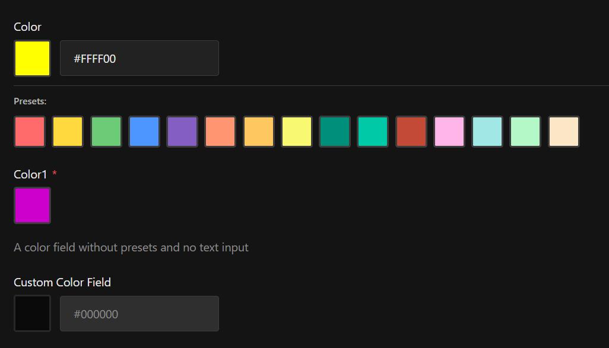
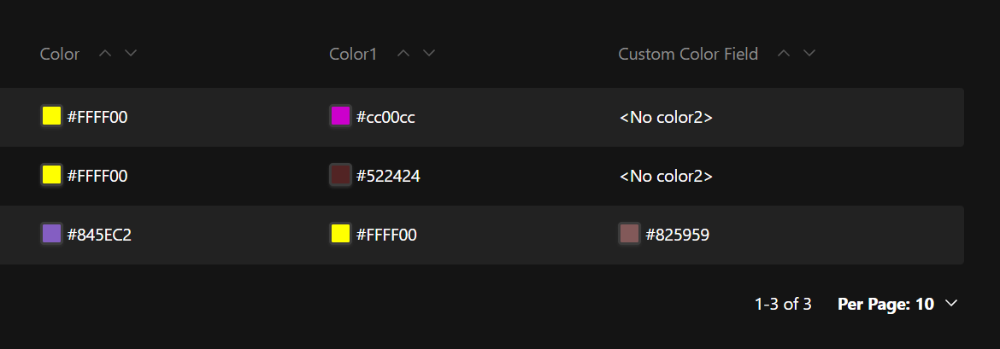

import { TypeTable } from 'fumadocs-ui/components/type-table';

import { ComponentPreview } from "@/components/component-preview"
import { Tabs, TabsContent, TabsList, TabsTrigger } from "@/components/ui/tabs"
import {ManualInstall} from "@/components/manual-install"

<ComponentPreview name="color-picker" />

## Installation

<Tabs defaultValue="cli">
  <TabsList >
    <TabsTrigger value="cli">CLI</TabsTrigger>
    <TabsTrigger value="manual">Manual</TabsTrigger>
  </TabsList>
  <TabsContent value="cli">

Use the following command to install the color picker field:

```npm
npx shadcn@latest add https://payload.veiag.dev/r/color-picker.json
```

<Callout title="Important" type="error">
  Currently, shadcn CLI removes `use client` directive from the top of the files. 
  Please ensure to add it back to the top of `index.tsx` file in the color picker field directory.
  I think this should be fixed in future releases of shadcn CLI.
</Callout>

  </TabsContent>
  <TabsContent value="manual">
Copy and paste the following code into your project to manually install the color picker field:

<ManualInstall name="color-picker" />

  </TabsContent>
</Tabs>

## Usage

### Basic usage

```typescript
import { colorField } from '@/fields/color-picker/field'

export const MyCollection = {
  slug: 'my-collection',
  fields: [
    colorField({
      name: 'backgroundColor',
      required: true,
      description: 'Choose a background color for your page',
    }),
  ],
}
```

### With presets

```typescript
import { colorField } from '@/fields/color-picker/field'

export const MyCollection = {
  slug: 'my-collection',
  fields: [
    colorField({
      name: 'themeColor',
      colorPresets: [
        '#FF6B6B',
        '#4ECDC4',
        '#45B7D1',
        '#FFA07A',
        '#98D8C8',
        '#F7DC6F',
        '#BB8FCE',
        '#85C1E2',
      ],
      showTextInput: true,
      debounceDelay: 500,
    }),
  ],
}
```

### Advanced usage

```typescript
import { colorField } from '@/fields/color-picker/field'

export const MyCollection = {
  slug: 'my-collection',
  fields: [
    colorField({
      name: 'brandColor',
      required: true,
      description: 'Primary brand color',
      colorPresets: ['#0066FF', '#FF3366', '#00CC66'],
      debounceDelay: 300,
      showTextInput: true,
      overrides: (field) => ({
        ...field,
        admin: {
          ...field.admin,
          condition: (data) => data.useCustomBranding === true,
        },
      }),
    }),
  ],
}
```

## Screenshots



## API Reference

<TypeTable
  type={{
    name: {
      description: 'The name of the field',
      type: 'string',
      default: "'color'",
    },
    required: {
      description: 'Whether the field is required',
      type: 'boolean',
      default: 'false',
    },
    colorPresets: {
      description: 'Array of hex color codes for quick selection',
      type: 'string[]',
      default: '[]',
    },
    debounceDelay: {
      description: 'Debounce delay in milliseconds',
      type: 'number',
      default: '300',
    },
    showTextInput: {
      description: 'Show text input alongside color picker',
      type: 'boolean',
      default: 'true',
    },
    description: {
      description: 'Description for the admin UI',
      type: 'string',
      default: '-',
    },
    overrides: {
      description: 'Function to override field at a granular level',
      type: '(field: TextField) => TextField',
      default: '-',
    },
  }}
/>

## Features

- **Color Presets** - Provide a list of preset colors for quick selection
- **Debounced Input** - Configurable debounce delay for smooth typing experience
- **Hex Validation** - Built-in validation for hex color format with visual feedback
- **Native Color Input** - Uses native HTML color input for consistent UX across browsers
- **Custom Cell Component** - Displays a color swatch in admin list views