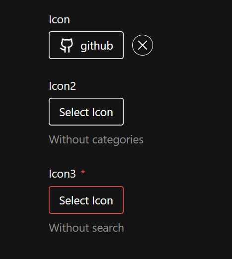
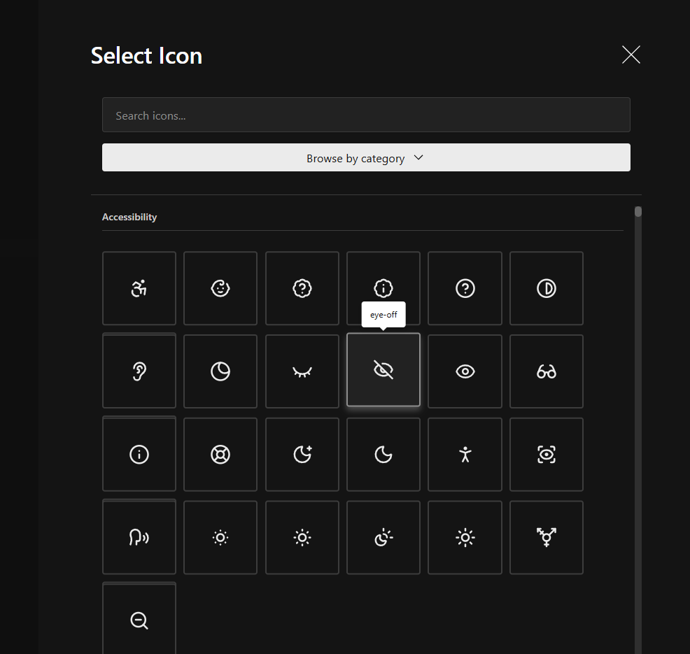
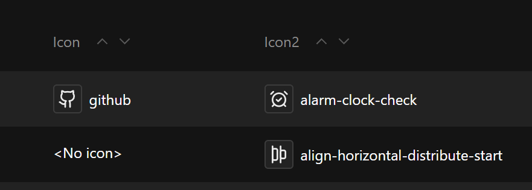

import { TypeTable } from 'fumadocs-ui/components/type-table';

import { ComponentPreview } from "@/components/component-preview"
import { Tabs, TabsContent, TabsList, TabsTrigger } from "@/components/ui/tabs"
import {ManualInstall} from "@/components/manual-install"

<ComponentPreview name="lucide-icon-picker" />
<Callout title="Experimental" type="warning">
    This field is currently experimental. Please report any issues you encounter on the github repository.
</Callout>

## Installation

<Tabs defaultValue="cli">
  <TabsList >
    <TabsTrigger value="cli">CLI</TabsTrigger>
    <TabsTrigger value="manual">Manual</TabsTrigger>
  </TabsList>
  <TabsContent value="cli">

Use the following command to install the icon picker field:

```npm
npx shadcn@latest add https://payload.veiag.dev/r/lucide-icon-picker.json
```

<Callout title="Important" type="error">
  Currently, shadcn CLI removes `use client` directive from the top of the files. 
  Please ensure to add it back to the top of `index.tsx` file in the icon picker field directory.
  I think this should be fixed in future releases of shadcn CLI.
</Callout>

  </TabsContent>
  <TabsContent value="manual">

Install the required dependencies:

```npm
npm install lucide-react fuse.js @tanstack/react-virtual usehooks-ts
```

Copy and paste the following code into your project to manually install the icon picker field:

<ManualInstall name="lucide-icon-picker" />

  </TabsContent>
</Tabs>

## Usage

### Basic usage

```typescript
import { iconField } from '@/fields/icon-picker/field'

export const MyCollection = {
  slug: 'my-collection',
  fields: [
    iconField({
      name: 'icon',
      required: true,
      description: 'Choose an icon for this feature',
    }),
  ],
}
```

### With custom configuration

```typescript
import { iconField } from '@/fields/icon-picker/field'

export const MyCollection = {
  slug: 'my-collection',
  fields: [
    iconField({
      name: 'menuIcon',
      showTextInput: true,
      searchable: true,
      categorized: true,
      searchPlaceholder: 'Find your icon...',
      triggerPlaceholder: 'Choose Icon',
      description: 'Icon displayed in the navigation menu',
    }),
  ],
}
```

### Advanced usage

```typescript
import { iconField } from '@/fields/icon-picker/field'

export const MyCollection = {
  slug: 'my-collection',
  fields: [
    iconField({
      name: 'featureIcon',
      required: true,
      showTextInput: false,
      searchable: true,
      categorized: true,
      searchPlaceholder: 'Search icons...',
      triggerPlaceholder: 'Select Feature Icon',
      overrides: (field) => ({
        ...field,
        admin: {
          ...field.admin,
          condition: (data) => data.showIcon === true,
        },
      }),
    }),
  ],
}
```

## Screenshots




## API Reference

<TypeTable
  type={{
    name: {
      description: 'The name of the field',
      type: 'string',
      default: "'icon'",
    },
    required: {
      description: 'Whether the field is required',
      type: 'boolean',
      default: 'false',
    },
    showTextInput: {
      description: 'Show text input for manual icon name entry',
      type: 'boolean',
      default: 'false',
    },
    searchable: {
      description: 'Enable search functionality in the drawer',
      type: 'boolean',
      default: 'true',
    },
    categorized: {
      description: 'Group icons by category with navigation',
      type: 'boolean',
      default: 'true',
    },
    searchPlaceholder: {
      description: 'Placeholder text for search input',
      type: 'string',
      default: "'Search icons...'",
    },
    triggerPlaceholder: {
      description: 'Placeholder text for the trigger button',
      type: 'string',
      default: "'Select Icon'",
    },
    description: {
      description: 'Description for the admin UI',
      type: 'string',
      default: '-',
    },
    overrides: {
      description: 'Function to override field at a granular level',
      type: '(field: TextField) => TextField',
      default: '-',
    },
  }}
/>

## Features

- **Lucide Icons** - Access to the complete Lucide icon library with dynamic loading
- **Fuzzy Search** - Powered by Fuse.js for intelligent icon discovery by name, tags, and categories
- **Virtualized Rendering** - Smooth performance with @tanstack/react-virtual, rendering only visible icons
- **Category Navigation** - Browse icons organized by category with quick jump navigation
- **Icon Preview** - Visual preview of selected icon in both edit and list views
- **Debounced Search** - Optimized search with 200ms debounce for smooth typing experience
- **Responsive Design** - Adapts to different screen sizes with mobile-optimized grid layouts
- **Tooltips** - Hover tooltips showing icon names for easy identification
- **Custom Cell Component** - Displays icon preview with name in admin list views
- **Keyboard Accessible** - Full keyboard navigation and focus management