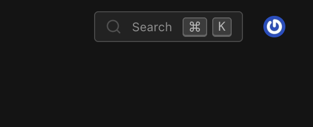
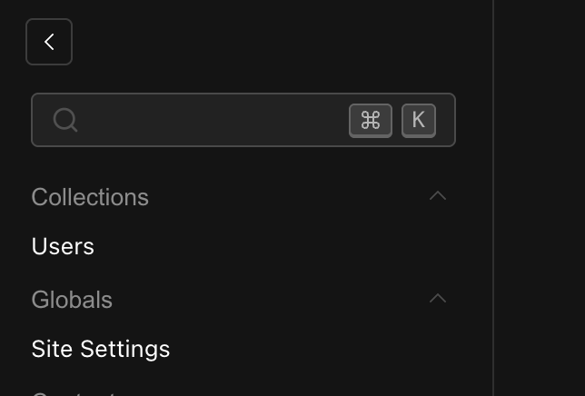
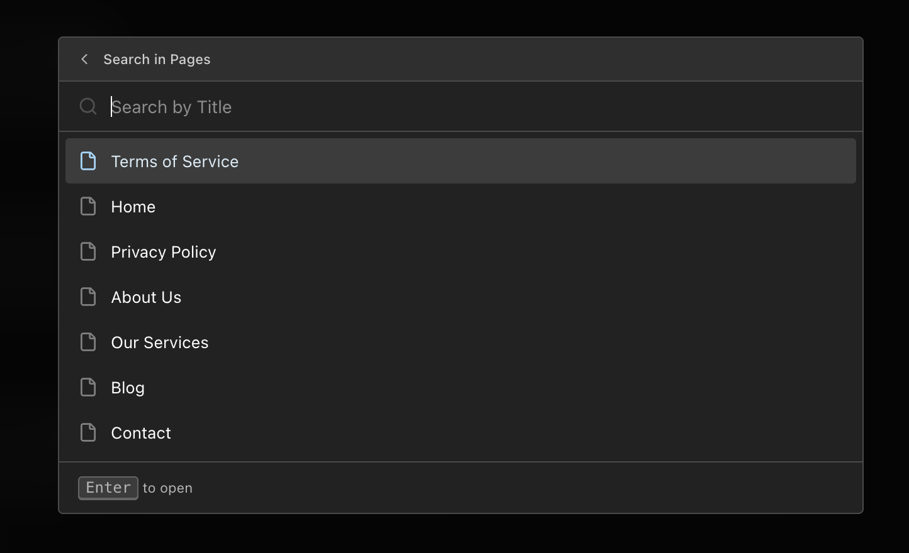
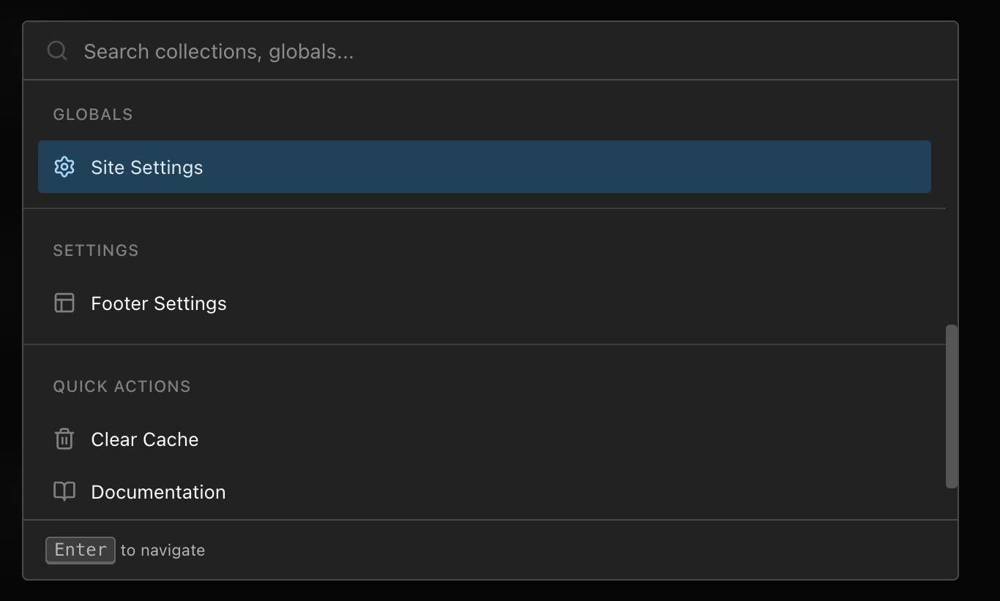

import { Tabs, TabsContent, TabsList, TabsTrigger } from "@/components/ui/tabs"
import { TypeTable } from 'fumadocs-ui/components/type-table';

## Overview

The Payload CMDK Plugin adds a powerful command menu to your Payload CMS admin panel, enabling quick search and navigation through collections, globals, and custom actions using keyboard shortcuts.


<Callout title="Features" type="info">
- **Quick Search**: Instantly search across all collections and globals
- **Keyboard Shortcuts**: Fully customizable keyboard shortcuts powered by react-hotkeys-hook
- **Collection Submenu**: Search within collection documents by their title field
- **Custom Icons**: Use any Lucide icon for collections and globals
- **Custom Items**: Add custom actions and menu groups
- **i18n Support**: Built-in English and Ukrainian translations, easily add your own
- **Cross-platform**: Optimized shortcuts for both macOS and Windows/Linux
</Callout>

## Installation

```npm
npm install @veiag/payload-cmdk
```

## Quick Start

### 1. Add Plugin to Config

The plugin works out of the box with minimal configuration:

```typescript
import { payloadCmdk } from '@veiag/payload-cmdk'
import { buildConfig } from 'payload'

export default buildConfig({
  // ... your existing config
  plugins: [
    payloadCmdk({
      // Plugin works without any options!
    }),
  ],
})
```

### 2. Start Your Server

The plugin will automatically:
- Add a search button to the admin panel
- Enable `⌘K` (Mac) / `Ctrl+K` (Windows/Linux) keyboard shortcut
- List all collections and globals in the command menu
- Enable collection submenu search

<Callout title="Default Behavior" type="info">
By default, the command menu can be opened with `⌘K` on macOS or `Ctrl+K` on Windows/Linux. A search button will appear in the actions area of your admin panel.
</Callout>

## Configuration

### Plugin Options

<TypeTable
  type={{
    shortcut: {
      description: 'Keyboard shortcut(s) to open the command menu',
      type: 'string | string[]',
      default: "['meta+k', 'ctrl+k']",
    },
    searchButton: {
      description: 'Search button configuration (set to false to hide)',
      type: "{ position?: 'actions' | 'nav' } | false",
      default: "{ position: 'actions' }",
    },
    blurBg: {
      description: 'Enable backdrop blur effect when menu is open',
      type: 'boolean',
      default: 'true',
    },
    submenu: {
      description: 'Configuration for collection document search submenu',
      type: 'SubmenuConfig',
      default: "{ enabled: true, shortcut: 'shift+enter' }",
    },
    icons: {
      description: 'Custom Lucide icons for collections and globals',
      type: 'IconsConfig',
      default: '-',
    },
    customItems: {
      description: 'Array of custom menu items and groups',
      type: 'Array<CustomMenuItem | CustomMenuGroup>',
      default: '[]',
    },
    slugsToIgnore: {
      description: 'Collection/global slugs to exclude from command menu',
      type: 'CollectionSlug[] | IgnoreConfig',
      default: "['payload-migrations', 'payload-preferences', 'payload-locked-documents']",
    },
    disabled: {
      description: 'Disable the plugin entirely',
      type: 'boolean',
      default: 'false',
    },
  }}
/>

### Full Configuration Example

```typescript
import { payloadCmdk } from '@veiag/payload-cmdk'
import { buildConfig } from 'payload'

export default buildConfig({
  plugins: [
    payloadCmdk({
      // Keyboard shortcut to open the menu
      shortcut: ['meta+k', 'ctrl+k'],

      // Search button configuration
      searchButton: {
        position: 'actions', // 'actions' | 'nav'
      },

      // Backdrop blur effect
      blurBg: true,

      // Collection submenu configuration
      submenu: {
        enabled: true,
        shortcut: 'shift+enter',
        icons: {
          posts: 'FileText',
          users: 'User',
        },
      },

      // Custom icons for collections and globals
      icons: {
        collections: {
          posts: 'FileText',
          pages: 'File',
          media: 'Image',
          users: 'Users',
        },
        globals: {
          settings: 'Settings',
          navigation: 'Menu',
        },
      },

      // Collections/globals to ignore
      slugsToIgnore: ['payload-migrations', 'payload-preferences'],

      // Custom menu items
      customItems: [
        {
          type: 'group',
          title: 'Quick Actions',
          items: [
            {
              type: 'item',
              slug: 'view-site',
              label: 'View Site',
              icon: 'ExternalLink',
              action: {
                type: 'link',
                href: 'https://your-site.com',
              },
            },
          ],
        },
      ],
    }),
  ],
})
```

## Keyboard Shortcuts

### Global Shortcuts [!toc]

| Shortcut | Action |
|----------|--------|
| `⌘K` / `Ctrl+K` | Open/close command menu |
| `Esc` | Close menu or go back in submenu |
| `↑` `↓` | Navigate items |
| `Enter` | Select item or navigate to collection |
| `Shift+Enter` | Search within collection (default) |

### In Submenu [!toc]

| Shortcut | Action |
|----------|--------|
| `Esc` | Go back to main menu |
| `Enter` | Open selected document |

### Custom Shortcuts [!toc]

Customize the keyboard shortcut using react-hotkeys-hook syntax:

```typescript
// Single shortcut
payloadCmdk({
  shortcut: 'ctrl+shift+k',
})

// Multiple shortcuts for cross-platform support
payloadCmdk({
  shortcut: ['meta+k', 'ctrl+k'],
})

// Alternative shortcuts
payloadCmdk({
  shortcut: ['meta+/', 'ctrl+/'],
})
```

<Callout title="Cross-platform Support" type="info">
Use `meta` for macOS Command key and `ctrl` for Windows/Linux Control key. Provide both for optimal cross-platform experience.
</Callout>

## Search Button

### Position Options [!toc]

The search button can be displayed in two locations:

**Actions Position (Default)**
```typescript
payloadCmdk({
  searchButton: {
    position: 'actions',
  },
})
```

**Navigation Position**
```typescript
payloadCmdk({
  searchButton: {
    position: 'nav',
  },
})
```

**Hide Search Button**
```typescript
payloadCmdk({
  searchButton: false, // Keyboard shortcut still works
})
```

Actions button position:




Navigation button position:



## Collection Submenu

The submenu feature allows searching within collection documents directly from the command menu.

### Submenu Configuration [!toc]

<TypeTable
  type={{
    enabled: {
      description: 'Enable or disable submenu functionality',
      type: 'boolean',
      default: 'true',
    },
    shortcut: {
      description: 'Keyboard shortcut to open submenu',
      type: "'shift+enter' | 'enter'",
      default: "'shift+enter'",
    },
    icons: {
      description: 'Custom icons for collection submenus',
      type: 'Record<string, LucideIconName>',
      default: 'undefined',
    },
  }}
/>

### Shortcut Behavior

**Default (`shift+enter`):**
- `Enter`: Navigate to collection list
- `Shift+Enter`: Open submenu to search within collection

**Alternative (`enter`):**
- `Enter`: Open submenu to search within collection
- `Shift+Enter`: Navigate to collection list

### Example [!toc]

```typescript
payloadCmdk({
  submenu: {
    enabled: true,
    shortcut: 'enter',
    icons: {
      posts: 'FileText',
      products: 'ShoppingCart',
    },
  },
})
```



### Title Field Configuration [!toc]

The submenu searches documents by their `useAsTitle` field. Configure this in your collection:

```typescript
{
  slug: 'posts',
  admin: {
    useAsTitle: 'title', // Submenu will search by this field
  },
  fields: [
    {
      name: 'title',
      type: 'text',
      required: true,
    },
    // ... other fields
  ],
}
```

<Callout title="Important" type="warning">
Ensure your `useAsTitle` field returns a string value. The plugin currently doesn't support non-string title fields, which may cause rendering errors.
</Callout>

## Custom Icons

Customize icons using [Lucide icon names](https://lucide.dev/icons).

### Default Icons [!toc]

- Collections: `Files` icon
- Globals: `Globe` icon

### Icon Configuration [!toc]

```typescript
payloadCmdk({
  icons: {
    collections: {
      posts: 'FileText',
      pages: 'File',
      media: 'Image',
      users: 'Users',
      categories: 'Folder',
      products: 'ShoppingCart',
      orders: 'Receipt',
    },
    globals: {
      settings: 'Settings',
      navigation: 'Menu',
      footer: 'Layout',
      seo: 'Search',
    },
  },
})
```

Browse all available icons at [lucide.dev/icons](https://lucide.dev/icons).



## Custom Menu Items

Add custom actions and external links to the command menu.

### Custom Item Structure [!toc]

```typescript
interface CustomMenuItem {
  type: 'item'
  slug: string
  label: string | LocalizedString
  icon?: LucideIconName
  action: {
    type: 'link' | 'api'
    href: string
    method?: 'GET' | 'POST' | 'PUT' | 'DELETE' // For API actions
    body?: Record<string, any> // For API actions
  }
}

interface CustomMenuGroup {
  type: 'group'
  title: string | LocalizedString
  items: CustomMenuItem[]
}
```

### Examples [!toc]

**Link Action**
```typescript
payloadCmdk({
  customItems: [
    {
      type: 'item',
      slug: 'view-site',
      label: 'View Site',
      icon: 'ExternalLink',
      action: {
        type: 'link',
        href: 'https://your-site.com',
      },
    },
    {
      type: 'item',
      slug: 'documentation',
      label: 'View Documentation',
      icon: 'BookOpen',
      action: {
        type: 'link',
        href: 'https://docs.your-site.com',
      },
    },
  ],
})
```

**API Action**
```typescript
payloadCmdk({
  customItems: [
    {
      type: 'item',
      slug: 'clear-cache',
      label: 'Clear Cache',
      icon: 'Trash2',
      action: {
        type: 'api',
        method: 'POST',
        href: '/api/cache/clear',
      },
    },
    {
      type: 'item',
      slug: 'regenerate',
      label: 'Regenerate Cache',
      icon: 'RefreshCw',
      action: {
        type: 'api',
        method: 'POST',
        href: '/api/cache/regenerate',
        body: { force: true },
      },
    },
  ],
})
```

**Grouped Items**
```typescript
payloadCmdk({
  customItems: [
    {
      type: 'group',
      title: 'Quick Actions',
      items: [
        {
          type: 'item',
          slug: 'view-site',
          label: 'View Site',
          icon: 'ExternalLink',
          action: {
            type: 'link',
            href: 'https://your-site.com',
          },
        },
        {
          type: 'item',
          slug: 'clear-cache',
          label: 'Clear Cache',
          icon: 'Trash2',
          action: {
            type: 'api',
            method: 'POST',
            href: '/api/cache/clear',
          },
        },
      ],
    },
  ],
})
```

**With Localization**
```typescript
payloadCmdk({
  customItems: [
    {
      type: 'group',
      title: {
        en: 'Quick Actions',
        uk: 'Швидкі дії',
      },
      items: [
        {
          type: 'item',
          slug: 'view-site',
          label: {
            en: 'View Site',
            uk: 'Переглянути сайт',
          },
          icon: 'ExternalLink',
          action: {
            type: 'link',
            href: 'https://your-site.com',
          },
        },
      ],
    },
  ],
})
```

## Ignoring Collections

Exclude specific collections or globals from the command menu.

### Default Ignored Slugs [!toc]

```typescript
['payload-migrations', 'payload-preferences', 'payload-locked-documents']
```

### Add to Ignore List [!toc]

```typescript
payloadCmdk({
  slugsToIgnore: ['internal-collection', 'test-data', 'drafts'],
})
```

### Replace Default Ignore List [!toc]

```typescript
payloadCmdk({
  slugsToIgnore: {
    ignoreList: ['my-hidden-collection'],
    replaceDefaults: true, // Only ignore specified collections
  },
})
```

## Internationalization

The plugin includes built-in translations for English and Ukrainian. Add support for additional languages using Payload's i18n configuration.

### Available Translation Keys [!toc]

All translation keys are under the `cmdkPlugin` namespace:

| Key | Description | Example (EN) |
|-----|-------------|--------------|
| `search` | Main search placeholder | "Search collections, globals..." |
| `searchShort` | Short search label | "Search" |
| `searchIn` | Submenu search placeholder | "Search in \{\{label\}\}" |
| `loading` | Loading state | "Loading..." |
| `noResults` | No results state | "No results found" |
| `navigate` | Footer hint for navigation | "to navigate" |
| `searchInCollection` | Footer hint for collection search | "to search in collection" |
| `open` | Footer hint for opening documents | "to open" |

### Adding Custom Translations

```typescript
import { buildConfig } from 'payload'

export default buildConfig({
  i18n: {
    supportedLanguages: {
      en,
      uk,
      de,
      fr,
    },
    translations: {
      de: {
        cmdkPlugin: {
          loading: 'Lädt...',
          navigate: 'zum Navigieren',
          noResults: 'Keine Ergebnisse gefunden',
          open: 'zum Öffnen',
          search: 'Sammlungen, Globals durchsuchen...',
          searchIn: 'Suchen in {{label}}',
          searchInCollection: 'in Sammlung suchen',
          searchShort: 'Suchen',
        },
      },
      fr: {
        cmdkPlugin: {
          loading: 'Chargement...',
          navigate: 'pour naviguer',
          noResults: 'Aucun résultat trouvé',
          open: 'pour ouvrir',
          search: 'Rechercher collections, globals...',
          searchIn: 'Rechercher dans {{label}}',
          searchInCollection: 'pour rechercher dans la collection',
          searchShort: 'Rechercher',
        },
      },
    },
  },
  plugins: [
    payloadCmdk({
      // Your config
    }),
  ],
})
```

## Examples

### Minimal Setup [!toc]

```typescript
export default buildConfig({
  plugins: [payloadCmdk()],
})
```

### Keyboard Shortcuts Only [!toc]

```typescript
export default buildConfig({
  plugins: [
    payloadCmdk({
      shortcut: ['meta+/', 'ctrl+/'],
      searchButton: false, // Hide button, only use keyboard
    }),
  ],
})
```

### Blog Setup [!toc]

```typescript
export default buildConfig({
  plugins: [
    payloadCmdk({
      icons: {
        collections: {
          posts: 'Newspaper',
          authors: 'UserCircle',
          categories: 'FolderTree',
          tags: 'Tag',
          comments: 'MessageCircle',
        },
        globals: {
          settings: 'Settings',
          navigation: 'Menu',
        },
      },
      submenu: {
        enabled: true,
        icons: {
          posts: 'FileText',
          authors: 'User',
        },
      },
    }),
  ],
})
```

### E-commerce Setup [!toc]

```typescript
export default buildConfig({
  plugins: [
    payloadCmdk({
      icons: {
        collections: {
          products: 'ShoppingCart',
          orders: 'Receipt',
          customers: 'Users',
          categories: 'Folder',
          reviews: 'Star',
        },
        globals: {
          settings: 'Settings',
          shipping: 'Truck',
        },
      },
      customItems: [
        {
          type: 'group',
          title: 'Store Actions',
          items: [
            {
              type: 'item',
              slug: 'view-store',
              label: 'View Storefront',
              icon: 'Store',
              action: {
                type: 'link',
                href: 'https://your-store.com',
              },
            },
            {
              type: 'item',
              slug: 'sync-inventory',
              label: 'Sync Inventory',
              icon: 'RefreshCw',
              action: {
                type: 'api',
                method: 'POST',
                href: '/api/inventory/sync',
              },
            },
          ],
        },
      ],
    }),
  ],
})
```

### Full Custom Theme [!toc]

```typescript
export default buildConfig({
  plugins: [
    payloadCmdk({
      shortcut: ['meta+k', 'ctrl+k'],
      searchButton: {
        position: 'nav',
      },
      blurBg: true,
      icons: {
        collections: {
          posts: 'Newspaper',
          pages: 'FileText',
          media: 'Image',
          categories: 'FolderTree',
          tags: 'Tag',
          users: 'UserCircle',
          comments: 'MessageCircle',
        },
        globals: {
          header: 'LayoutTemplate',
          footer: 'Layout',
          settings: 'Settings',
          navigation: 'Menu',
          seo: 'Search',
        },
      },
      submenu: {
        enabled: true,
        shortcut: 'shift+enter',
        icons: {
          posts: 'FileText',
          pages: 'File',
          media: 'Image',
        },
      },
      customItems: [
        {
          type: 'group',
          title: 'Quick Links',
          items: [
            {
              type: 'item',
              slug: 'view-site',
              label: 'View Live Site',
              icon: 'ExternalLink',
              action: {
                type: 'link',
                href: 'https://your-site.com',
              },
            },
            {
              type: 'item',
              slug: 'documentation',
              label: 'Documentation',
              icon: 'BookOpen',
              action: {
                type: 'link',
                href: 'https://docs.your-site.com',
              },
            },
          ],
        },
      ],
      slugsToIgnore: ['payload-migrations', 'test-data'],
    }),
  ],
})
```

## Troubleshooting

### Objects are not valid as a React child [!toc]

**Cause:** Your `admin.useAsTitle` field is returning an object instead of a string.

**Solution:** Ensure the field specified in `useAsTitle` returns a string value:

```typescript
{
  slug: 'posts',
  admin: {
    useAsTitle: 'title', // Must be a simple text field
  },
  fields: [
    {
      name: 'title',
      type: 'text', // Not an object or complex field
      required: true,
    },
  ],
}
```

### Command menu not opening [!toc]

**Solutions:**
1. Verify keyboard shortcut isn't conflicting with browser/OS shortcuts
2. Check browser console for JavaScript errors
3. Ensure the plugin is properly loaded in your config

### Icons not displaying [!toc]

**Solutions:**
1. Verify icon names match exactly with [Lucide icons](https://lucide.dev/icons)
2. Icon names are case-sensitive: use `FileText`, not `filetext`
3. Check browser console for errors

### Search button not visible [!toc]

**Solutions:**
1. Check `searchButton` configuration isn't set to `false`
2. Verify `position` value is either `'actions'` or `'nav'`
3. Clear browser cache and reload

## Links

- [cmdk Component](https://cmdk.paco.me/)
- [NPM Package](https://www.npmjs.com/package/@veiag/payload-cmdk)
- [GitHub Repository](https://github.com/VeiaG/payload-cmdk)
- [Lucide Icons](https://lucide.dev/icons)
- [react-hotkeys-hook Documentation](https://react-hotkeys-hook.vercel.app/docs/intro)

## License

[MIT](https://github.com/VeiaG/payload-cmdk/blob/main/LICENSE)