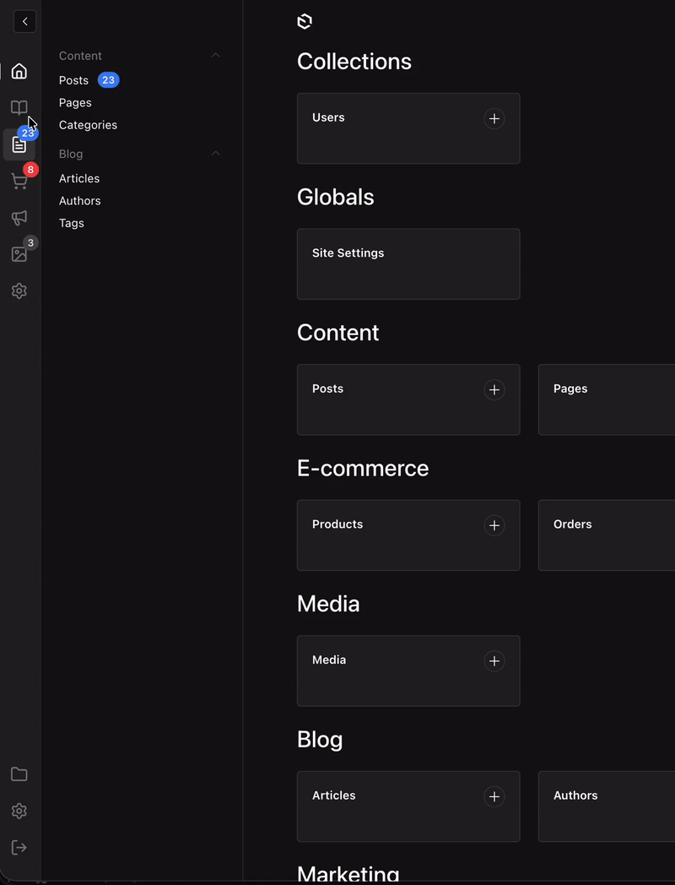
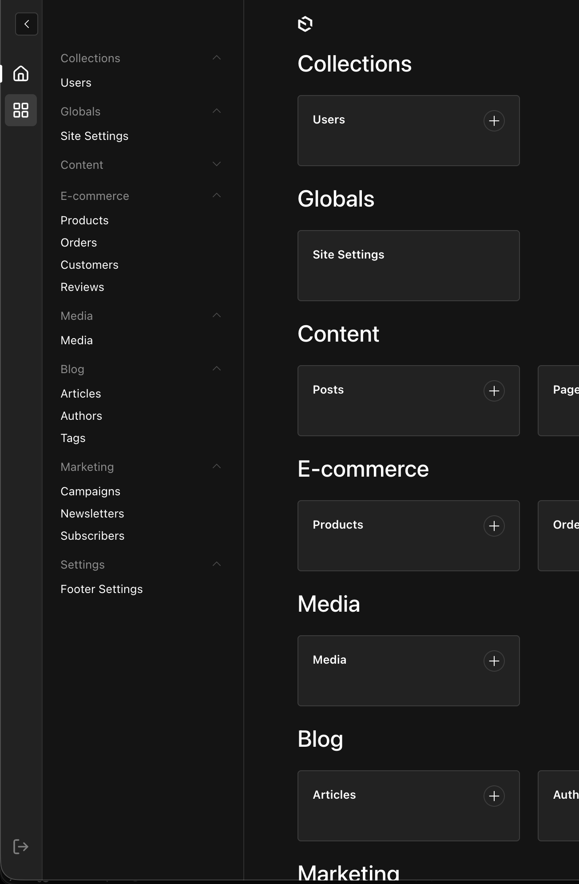
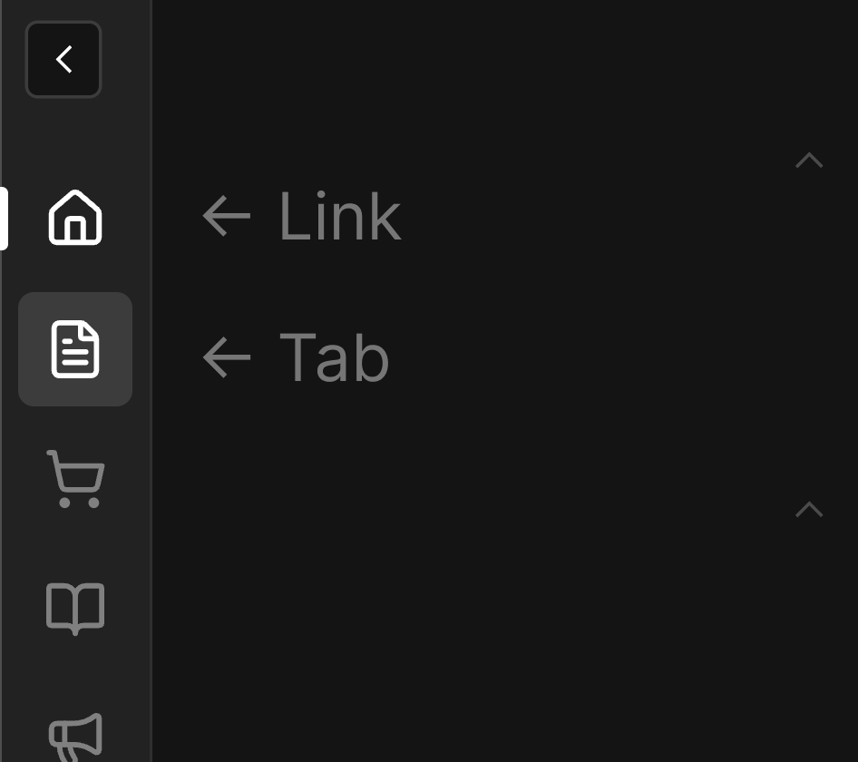
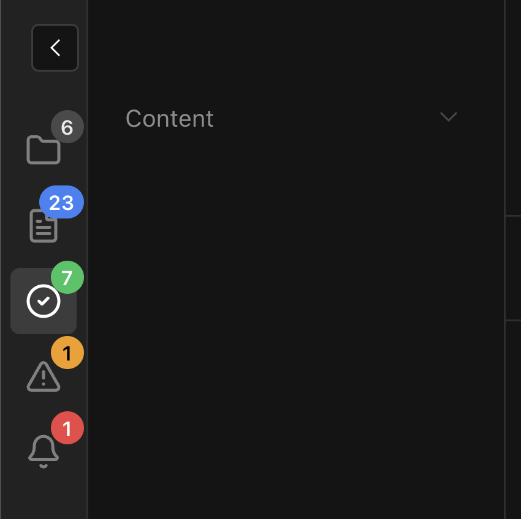

import { Tabs, TabsContent, TabsList, TabsTrigger } from "@/components/ui/tabs"
import { TypeTable } from 'fumadocs-ui/components/type-table';

<Callout title="Development Status" type="warning">
This plugin is in early development and has not been extensively tested. Use with caution in production environments.
</Callout>

## Overview

The Payload Enhanced Sidebar Plugin transforms your admin navigation with a modern tabbed interface, helping you organize collections and globals into logical groups for cleaner, more efficient navigation.

<Callout title="Features" type="info">
- **Tabbed Navigation**: Organize collections into separate tabs for cleaner navigation
- **Vertical Tab Bar**: Icon-based tabs on the left side of the sidebar
- **Link Support**: Add navigation links (like Dashboard) alongside tabs
- **Custom Items**: Add custom navigation items that can be merged into existing groups
- **Badges**: Show notification badges on tabs and navigation items (API-based or reactive provider)
- **i18n Support**: Full localization support for labels and groups
- **Lucide Icons**: Use any [Lucide icon](https://lucide.dev/icons) for tabs and links
</Callout>




## Installation

```npm
npm install @veiag/payload-enhanced-sidebar
```

## Quick Start

```typescript
import { payloadEnhancedSidebar } from '@veiag/payload-enhanced-sidebar'
import { buildConfig } from 'payload'

export default buildConfig({
  // ... your config
  plugins: [
    payloadEnhancedSidebar({
      // Works with defaults!
    }),
  ],
})
```

This will add:
- A Dashboard link at the top
- A default tab showing all collections and globals
- A logout button at the bottom




## Configuration

### Full Configuration Example [!toc]

```typescript
import { payloadEnhancedSidebar } from '@veiag/payload-enhanced-sidebar'
import { buildConfig } from 'payload'

export default buildConfig({
  plugins: [
    payloadEnhancedSidebar({
      // Tabs and links in the sidebar
      tabs: [
        // Dashboard link
        {
          id: 'dashboard',
          type: 'link',
          href: '/',
          icon: 'House',
          label: { en: 'Dashboard', uk: 'Головна' },
        },
        // Content tab - shows specific collections
        {
          id: 'content',
          type: 'tab',
          icon: 'FileText',
          label: { en: 'Content', uk: 'Контент' },
          collections: ['posts', 'pages', 'categories'],
        },
        // Link to external documentation
        {
          id: 'docs',
          type: 'link',
          href: 'https://payloadcms.com/',
          icon: 'BookOpen',
          isExternal: true,
          label: { en: 'Documentation', uk: 'Документація' },
        },
        // E-commerce tab with custom items
        {
          id: 'ecommerce',
          type: 'tab',
          icon: 'ShoppingCart',
          label: { en: 'E-commerce', uk: 'E-commerce' },
          collections: ['products', 'orders', 'customers'],
          customItems: [
            {
              slug: 'analytics',
              href: '/analytics',
              label: { en: 'Analytics', uk: 'Аналітика' },
              group: 'E-commerce', // Merge into existing group
            },
          ],
        },
        // Settings tab with globals
        {
          id: 'settings',
          type: 'tab',
          icon: 'Settings',
          label: { en: 'Settings', uk: 'Налаштування' },
          collections: ['users'],
          globals: ['site-settings', 'footer-settings'],
          customItems: [
            {
              slug: 'api-keys',
              href: '/api-keys',
              label: { en: 'API Keys', uk: 'API Ключі' },
              // No group - will appear at the bottom
            },
            {
              slug:'external-link',
              href: 'https://example.com',
              isExternal: true,
              label: { en: 'External Link', uk: 'Зовнішнє Посилання'}
            }
          ],
        },
      ],

      // Show/hide logout button (default: true)
      showLogout: true,

      // Disable the plugin
      disabled: false,
    }),
  ],
})
```

## Plugin Options

### `tabs` [!toc]

Array of tabs and links to show in the sidebar.

#### Tab Configuration (`type: 'tab'`) [!toc]

<TypeTable
  type={{
    id: {
      description: 'Unique identifier for the tab',
      type: 'string',
      default: '-',
    },
    type: {
      description: 'Tab type',
      type: "'tab'",
      default: '-',
    },
    icon: {
      description: 'Lucide icon name',
      type: 'string',
      default: '-',
    },
    label: {
      description: 'Tab tooltip/label (supports i18n)',
      type: 'string | LocalizedString',
      default: '-',
    },
    collections: {
      description: 'Collections to show in this tab',
      type: 'CollectionSlug[]',
      default: 'All collections',
    },
    globals: {
      description: 'Globals to show in this tab',
      type: 'GlobalSlug[]',
      default: 'All globals',
    },
    customItems: {
      description: 'Custom navigation items',
      type: 'SidebarTabItem[]',
      default: '-',
    },
    badge: {
      description: 'Badge configuration for the tab icon',
      type: 'BadgeConfig',
      default: '-',
    },
  }}
/>

<Callout title="Default Behavior" type="info">
If neither `collections` nor `globals` are specified, the tab shows all collections and globals.
</Callout>

#### Link Configuration (`type: 'link'`) [!toc]

<TypeTable
  type={{
    id: {
      description: 'Unique identifier for the link',
      type: 'string',
      default: '-',
    },
    type: {
      description: 'Link type',
      type: "'link'",
      default: '-',
    },
    icon: {
      description: 'Lucide icon name',
      type: 'string',
      default: '-',
    },
    label: {
      description: 'Link tooltip/label (supports i18n)',
      type: 'string | LocalizedString',
      default: '-',
    },
    href: {
      description: 'URL (relative or absolute)',
      type: 'string',
      default: '-',
    },
    isExternal: {
      description: 'If true, href is treated as absolute URL',
      type: 'boolean',
      default: 'false',
    },
    badge: {
      description: 'Badge configuration for the link icon',
      type: 'BadgeConfig',
      default: '-',
    },
  }}
/>




### `customItems` [!toc]

Custom items can be added to any tab to extend navigation functionality:

```typescript
{
  slug: 'unique-slug',           // Required: unique identifier
  href: '/path',                 // Required: URL (relative or absolute)
  label: { en: 'Label' },        // Required: display label
  group: { en: 'Group Name' },   // Optional: merge into existing group or create new
  isExternal: true,              // Optional: if true, href is absolute URL
}
```

#### Group Behavior [!toc]

- **Existing Group**: If `group` matches an existing collection group label, the item is added to that group
- **New Group**: If `group` doesn't match any existing group, a new group is created
- **Ungrouped**: If `group` is not specified, the item appears at the bottom without grouping

### General Options [!toc]

<TypeTable
  type={{
    showLogout: {
      description: 'Show/hide logout button at the bottom of tabs bar',
      type: 'boolean',
      default: 'true',
    },
    disabled: {
      description: 'Completely disable the plugin',
      type: 'boolean',
      default: 'false',
    },
  }}
/>

## Badges

Badges allow you to show notification counts on tabs and navigation items, perfect for drawing attention to pending tasks, unread notifications, or item counts.

### Badge Configuration [!toc]

There are three ways to configure badges:

#### 1. Badges on Tabs/Links [!toc]

Add a `badge` property directly to any tab or link:

```typescript
tabs: [
  {
    id: 'orders',
    type: 'tab',
    icon: 'ShoppingCart',
    label: 'Orders',
    collections: ['orders'],
    badge: {
      type: 'collection-count',
      collectionSlug: 'orders',
      color: 'error',
    },
  },
]
```

#### 2. Badges on Navigation Items [!toc]

Use the `badges` configuration to add badges to sidebar items:

```typescript
payloadEnhancedSidebar({
  badges: {
    // Show document count for posts collection
    posts: { type: 'collection-count', color: 'primary' },
    // Custom API endpoint
    orders: {
      type: 'api',
      endpoint: '/api/orders/pending',
      responseKey: 'count',
      color: 'error',
    },
    // Provider-based (reactive)
    notifications: { type: 'provider', color: 'warning' },
  },
})
```

### Badge Types [!toc]

#### Collection Count [!toc]

Automatically fetches document count from a collection:

<TypeTable
  type={{
    type: {
      description: 'Badge type',
      type: "'collection-count'",
      default: '-',
    },
    collectionSlug: {
      description: 'Collection slug to count documents from',
      type: 'string',
      default: "Item's slug",
    },
    color: {
      description: 'Badge color theme',
      type: 'BadgeColor',
      default: "'default'",
    },
    where: {
      description: 'Optional filter query for counting',
      type: 'object',
      default: '-',
    },
  }}
/>

```typescript
{
  type: 'collection-count',
  collectionSlug: 'orders',
  color: 'error',
  where: { status: { equals: 'pending' } },
}
```

#### API Endpoint [!toc]

Fetches badge value from a custom API endpoint:

<TypeTable
  type={{
    type: {
      description: 'Badge type',
      type: "'api'",
      default: '-',
    },
    endpoint: {
      description: 'API URL (relative or absolute)',
      type: 'string',
      default: '-',
    },
    method: {
      description: 'HTTP method',
      type: "'GET' | 'POST'",
      default: "'GET'",
    },
    responseKey: {
      description: 'Key to extract count from response',
      type: 'string',
      default: "'count'",
    },
    color: {
      description: 'Badge color theme',
      type: 'BadgeColor',
      default: "'default'",
    },
  }}
/>

```typescript
{
  type: 'api',
  endpoint: '/api/orders/pending',
  method: 'GET',
  responseKey: 'count',
  color: 'error',
}
```

#### Provider (Reactive) [!toc]

Uses reactive values from `BadgeProvider` context for real-time updates:

<TypeTable
  type={{
    type: {
      description: 'Badge type',
      type: "'provider'",
      default: '-',
    },
    slug: {
      description: 'Key in provider values object',
      type: 'string',
      default: "Item's slug/id",
    },
    color: {
      description: 'Badge color theme',
      type: 'BadgeColor',
      default: "'default'",
    },
  }}
/>

```typescript
{
  type: 'provider',
  slug: 'notifications',
  color: 'warning',
}
```

### Using BadgeProvider [!toc]

For reactive badges with real-time updates (websockets, polling, etc.):

**Step 1**: Create a provider component:

```typescript
// components/MyBadgeProvider.tsx
'use client'

import { BadgeProvider } from '@veiag/payload-enhanced-sidebar'
import { useEffect, useState } from 'react'

export const MyBadgeProvider = ({ children }) => {
  const [counts, setCounts] = useState({
    orders: 0,
    notifications: 0,
  })

  useEffect(() => {
    // Fetch initial counts, subscribe to websocket, etc.
    const ws = new WebSocket('wss://your-api/counts')
    ws.onmessage = (e) => setCounts(JSON.parse(e.data))
    return () => ws.close()
  }, [])

  return <BadgeProvider values={counts}>{children}</BadgeProvider>
}
```

**Step 2**: Add it to Payload's providers:

```typescript
// payload.config.ts
export default buildConfig({
  admin: {
    components: {
      providers: ['./components/MyBadgeProvider#MyBadgeProvider'],
    },
  },
})
```

**Step 3**: Configure badges to use the provider:

```typescript
payloadEnhancedSidebar({
  badges: {
    orders: { type: 'provider', color: 'error' },
  },
  tabs: [
    {
      id: 'notifications',
      type: 'link',
      href: '/notifications',
      icon: 'Bell',
      label: 'Notifications',
      badge: { type: 'provider', slug: 'notifications', color: 'warning' },
    },
  ],
})
```

### Badge Colors [!toc]

Available color themes: `default`, `primary`, `success`, `warning`, `error`



### Badge Display Rules [!toc]

- Numbers up to 99 are shown as-is
- Numbers > 99 are shown as "99+"
- Zero or undefined values hide the badge
- Provider values can also be React nodes for custom rendering

## Localization

All labels support localized strings for internationalization:

```typescript
// Simple string
label: 'Dashboard'

// Localized object
label: {
  en: 'Dashboard',
  uk: 'Головна',
  de: 'Übersicht',
  fr: 'Tableau de bord',
}
```

The plugin will automatically use the appropriate translation based on the user's locale settings.

## Payload Features Support

The plugin seamlessly integrates with Payload's built-in features:

- **Browse by Folder Button**: Automatically shows folder view button when Payload folders are enabled (requires Payload v3.41.0+)
- **Settings Menu Items**: Integrates with Payload's SettingsMenu components (requires Payload v3.60.0+)

## Examples

### Blog Setup [!toc]

```typescript
payloadEnhancedSidebar({
  tabs: [
    {
      id: 'dashboard',
      type: 'link',
      href: '/',
      icon: 'House',
      label: 'Dashboard',
    },
    {
      id: 'content',
      type: 'tab',
      icon: 'FileText',
      label: 'Content',
      collections: ['posts', 'pages', 'categories'],
      badge: {
        type: 'collection-count',
        collectionSlug: 'posts',
        where: { status: { equals: 'draft' } },
        color: 'warning',
      },
    },
    {
      id: 'users',
      type: 'tab',
      icon: 'Users',
      label: 'Users',
      collections: ['users'],
      globals: ['site-settings'],
    },
  ],
})
```

### E-commerce Setup [!toc]

```typescript
payloadEnhancedSidebar({
  tabs: [
    {
      id: 'dashboard',
      type: 'link',
      href: '/',
      icon: 'BarChart',
      label: 'Dashboard',
    },
    {
      id: 'catalog',
      type: 'tab',
      icon: 'Package',
      label: 'Catalog',
      collections: ['products', 'categories', 'brands'],
    },
    {
      id: 'orders',
      type: 'tab',
      icon: 'ShoppingCart',
      label: 'Orders',
      collections: ['orders', 'customers'],
      badge: {
        type: 'api',
        endpoint: '/api/orders/pending',
        color: 'error',
      },
    },
    {
      id: 'settings',
      type: 'tab',
      icon: 'Settings',
      label: 'Settings',
      collections: ['users'],
      globals: ['shipping-settings', 'payment-settings'],
    },
  ],
})
```

### Multi-language Platform [!toc]

```typescript
payloadEnhancedSidebar({
  tabs: [
    {
      id: 'dashboard',
      type: 'link',
      href: '/',
      icon: 'Home',
      label: {
        en: 'Dashboard',
        uk: 'Головна',
        de: 'Übersicht',
      },
    },
    {
      id: 'content',
      type: 'tab',
      icon: 'FileText',
      label: {
        en: 'Content',
        uk: 'Контент',
        de: 'Inhalt',
      },
      collections: ['articles', 'pages'],
    },
    {
      id: 'docs',
      type: 'link',
      href: 'https://docs.example.com',
      icon: 'BookOpen',
      isExternal: true,
      label: {
        en: 'Documentation',
        uk: 'Документація',
        de: 'Dokumentation',
      },
    },
  ],
})
```

## Contributing

Contributions are welcome! Here's how you can help:

1. Fork the repository
2. Create your feature branch (`git checkout -b feature/amazing-feature`)
3. Commit your changes (`git commit -m 'Add some amazing feature'`)
4. Push to the branch (`git push origin feature/amazing-feature`)
5. Open a Pull Request

## Issues

Found a bug or have a feature request? Please open an issue on [GitHub](https://github.com/VeiaG/payload-enhanced-sidebar/issues).

## Links

- [NPM Package](https://www.npmjs.com/package/@veiag/payload-enhanced-sidebar)
- [GitHub Repository](https://github.com/VeiaG/payload-enhanced-sidebar)
- [Payload CMS](https://payloadcms.com)
- [Lucide Icons](https://lucide.dev/icons)
